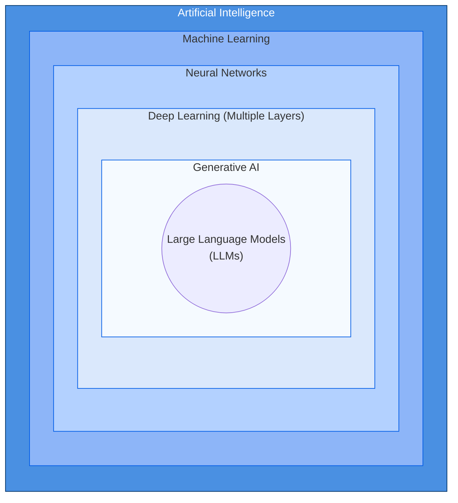
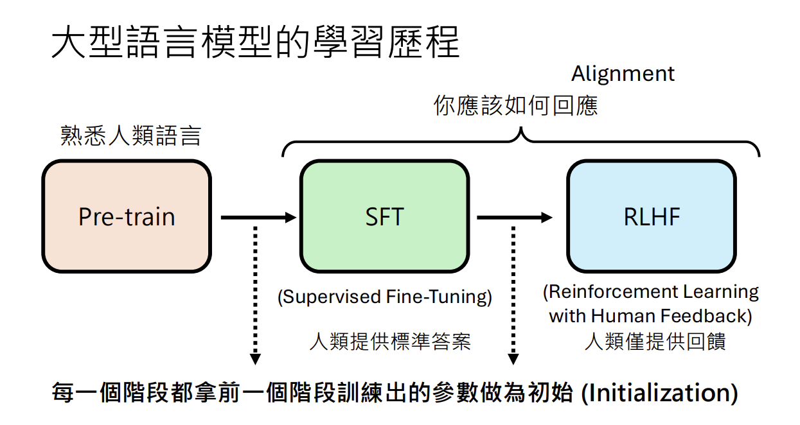
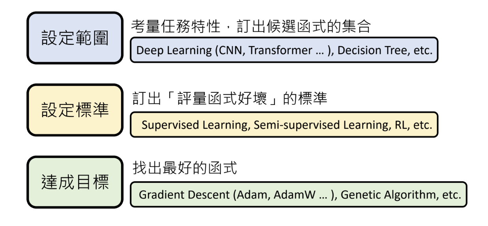
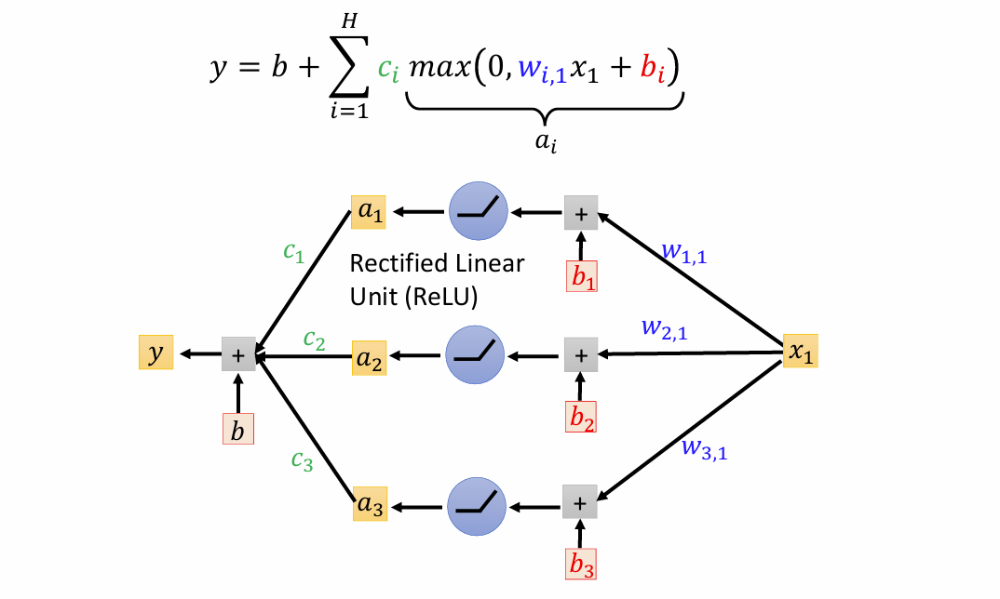
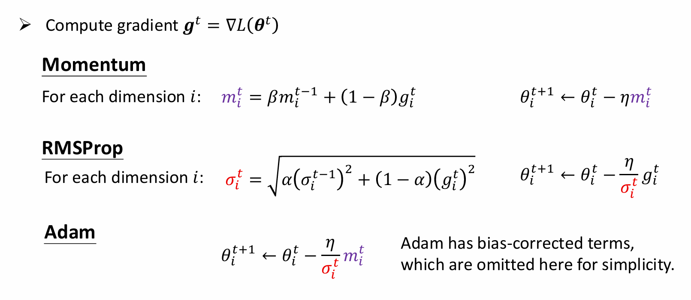
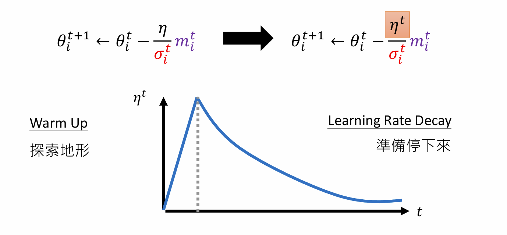

<!-- markdownlint-disable MD033 -->

# AI outline graph

---

# Definition: Generative AI

## 讓computer學會產生<u>複雜</u>而<u>有結構</u>的物件, 就是Classification, 因為Generative AI就是給一個未完成的句子, 去猜接下來接哪一個token

- 複雜 : 無限可能
- 有結構 : 由有限的<u>基本單位</u>(toekn)所構成
- 基本單位(token) : 
  - 影像 : 是由像素構成的. 每個像素又由RGB三個子像素組成,而每個子像素的可能值範圍為0-255. 影像只考慮兩個維度: width, height
  - 聲音訊號 : 是由取樣點構成的. 遠看是聲音訊號,拉進後則可以看到一個一個的取樣點.一秒鐘有多少取樣點,取決於取樣率(sampling rate);比如, 16kHz的取樣率意味著一秒鐘有16000個取樣點. 而每個取樣點有多少種可能的數值,則取決於取樣解析度(bit resolution);常見的16-bit解析度有65,536種可能的數值
  - 影片 : 就是一連串的圖片, 每一張圖片又叫Frame. 需考慮三個維度: width, height, time

---

# Retrieval Augmented Generation(RAG)

---

# Context Engineering的核心目標

- 避免塞爆Context(把需要的放進去,不需要的清出來)

- 常用招數
  - Select
    - 挑選需要的內容, e.g. RAG, Tool RAG, Memory RAG
  - Compress
  - Multi-Agent

---

# Machine Learning

## 0. ML三步驟

## 1. prepare data

- split to train data & test data

## 2. set a model

- 根據domain knowledge
  - Simple Linear Regression
    - $y = \beta_0 + \beta_1x + \epsilon$
      - 其中 $\beta_0$ 為截距，$\beta_1$ 為斜率，$\epsilon$ 為隨機誤差。
      - **$y, x$** is feature.**$\beta1$** is weight.**$\beta0$** is bias
  - Multiple Linear Regression
    - $y = \beta_0 + \beta_1x_1 + \beta_2x_2 + \dots + \beta_nx_n + \epsilon$
  -  Piecewise Linear Curves

  - Logistic Regression(分類問題, classification)
    - $P(y=1|x) = \frac{1}{1 + e^{-(\beta_0 + \beta_1x_1 + \dots + \beta_nx_n)}}$
   
  
  - Structured Learning
    - **create** something with structure(e.g. image, document)

## 3. set Cost function/Loss function

- Mean Squared Error, MSE
  - $MSE = \frac{1}{n} \sum_{i=1}^{n} (y_i - \hat{y}_i)^2$
    - $n$ : 訓練資料的總數 (Train Data Size / Batch Size).
    - $y_i$ : 第 $i$ 筆資料的真實標籤 (Ground Truth).
    - $\hat{y}_i$ : 模型對第 $i$ 筆資料的預測值 (Prediction)。
- Mean Absolute Error, MAE
  - $MAE = \frac{1}{n} \sum_{i=1}^{n} \left|(y_i - \hat{y}_i)\right|$
    - $n$ : 訓練資料的總數 (Train Data Size / Batch Size).
    - $y_i$ : 第 $i$ 筆資料的真實標籤 (Ground Truth).
    - $\hat{y}_i$ : 模型對第 $i$ 筆資料的預測值 (Prediction)。
- Cross-Entropy
  - if $y, \hat{y}$ are both probability distributions
  - $ Cross-Entropy=H(y, \hat{y}) = -\sum_{i=1}^{c} y_i \log(\hat{y}_i)$
    - $c$: The total number of classes or categories.
    - $y_i$: The probability of the $i$-th class in the true distribution (often a one-hot encoded vector where only one $y_i = 1$ and others are $0$).
    - $\hat{y}_i$: The probability of the $i$-th class predicted by the model (usually the output of a Softmax function($0 \le \hat{y}_i \le 1$ and $\sum \hat{y}_i = 1$.)).

## 4. set optimizer

- Gradient Descent(Vanilla Gradient Descent)
  - $ \theta ^ {t+1} = \theta ^ {t} - \eta \cdot \nabla L(\theta ^ {t})$
    - $\nabla L(w)$ 代表損失函數 $L$ 在當前參數 $w$ 位置的「斜率」或「坡度」
    - $\eta$ : The Learning Rate
  - 問題 : 只根據當下算出來的$g^t$來決定方向
    - 解法 : Gradient Descent + Optimizer
      - 根據$g^0,g^1,g^2,...,g^t$一起來決定方向(調整learning rate)
        - Adagrad
          - for each dimension i : $\eta=\frac{\eta}{\sigma_i^t}$, $\sigma_i^t=\sqrt{\sum_{i=0}^{t} (g_i^t)^2}$
          - 問題 : 每一個維度權重相同 
        - RMSProp
          - 解決Adagrad : 最近算出來的gradient給比較大的影響
          - use $\alpha$
  - 可以用 Momentum (下滑之物體會有動量繼續前行, 不會直接殺停)來繼續找
  global minimum用以脫離saddle point or local minimum
    - for each dimension i : $ \theta ^ {t+1} = \theta ^ {t} - \eta \cdot \color{purple}{m_i^t}$ , $\space$ $\color{purple}{m_i^t}$ = $\color{blue}{g_i^0}$ + $\color{green}{g_i^1}$ + $\color{orange}{g_i^2}$ +...+ $g^t$
  - Adam : RMSProp + Momentum

  - 也可以用Learning Rate Scheduling來調整learning rate

    - warp up : 給optimizer探索地形的機會, 因為剛進入一個新地圖, 不知道地圖有什麼, 設定一個大的learning rate, 讓參數亂跑, 可以大概知道地圖長什麼樣
  - Feature Scaling
    - accelerate gradient descent
  
    - Normalization
      - Batch Normalization
      - Layer Normalization
    - Standardizatoin

## 5.Train the model

- Initialization
  - Kaiming Initialization
- **Use gradient descent to train the model, accelerating convergence to the minimum loss and yielding the optimal model(Find the best $\beta_0, \beta_1, \beta_2, \beta_3,...., \epsilon$).**

## 6. use validation data to validate your model

- be aware of overfitting

## 7. use test data to test your model

- public test data
  - be aware of overfitting
- private test data
