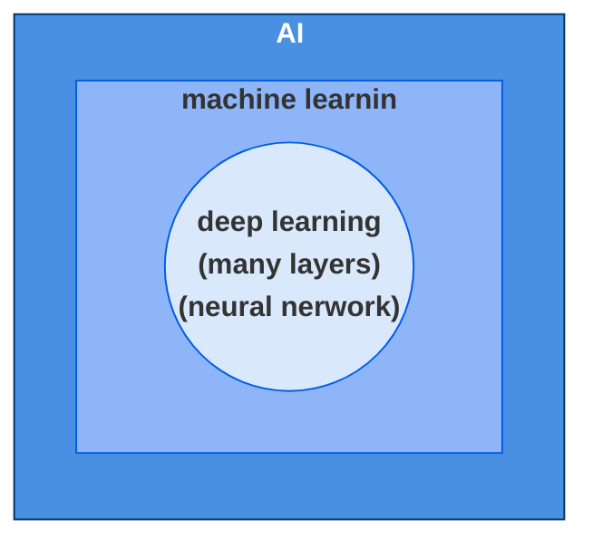

<!-- markdownlint-disable MD033 -->

# AI outline graph

---

# Definition: Generative AI

## 讓computer學會產生<u>複雜</u>而<u>有結構</u>的物件

- 複雜 : 無限可能
- 有結構 : 由有限的<u>基本單位</u>(toekn)所構成

---

# Retrieval Augmented Generation(RAG)

---

# Context Engineering的核心目標

- 避免塞爆Context(把需要的放進去,不需要的清出來)

- 常用招數
  - Select
    - 挑選需要的內容, e.g. RAG, Tool RAG, Memory RAG
  - Compress
  - Multi-Agent

---

# Machine Learning

## 1. prepare data

- split to train data & test data

## 2. set a model

- Simple Linear Regression
  - $y = \beta_0 + \beta_1x + \epsilon$
    - 其中 $\beta_0$ 為截距，$\beta_1$ 為斜率，$\epsilon$ 為隨機誤差。
- Multiple Linear Regression
  - $y = \beta_0 + \beta_1x_1 + \beta_2x_2 + \dots + \beta_nx_n + \epsilon$
- Logistic Regression(分類問題/classification)
  - $P(y=1|x) = \frac{1}{1 + e^{-(\beta_0 + \beta_1x_1 + \dots + \beta_nx_n)}}$
   
  

## 3. set Cost function/Loss function

- Mean Squared Error, MSE
  - $MSE = \frac{1}{n} \sum_{i=1}^{n} (y_i - \hat{y}_i)^2$
    - $n$ : 訓練資料的總數 (Train Data Size / Batch Size).
    - $y_i$ : 第 $i$ 筆資料的真實標籤 (Ground Truth).
    - $\hat{y}_i$ : 模型對第 $i$ 筆資料的預測值 (Prediction)。

## 4. set optimizer

- gradient descent
  - $w_{new} = w_{old} - \eta \cdot \nabla L(w)$
    - $\nabla L(w)$ 代表損失函數 $L$ 在當前參數 $w$ 位置的「斜率」或「坡度」
    - $\eta$ : The Learning Rate
  - accelerate gradient descent
    - Feature Scaling
  

## 5.Train the model

- **Use gradient descent to train the model, accelerating convergence to the minimum loss and yielding the optimal model(Find the best $\beta_0, \beta_1, \beta_2, \beta_3,...., \epsilon$).**

## 6. use test data to test your model
