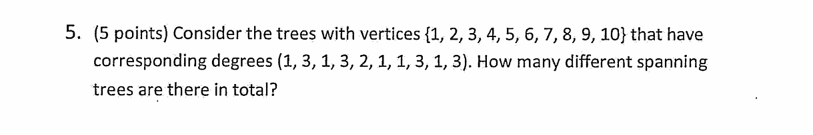
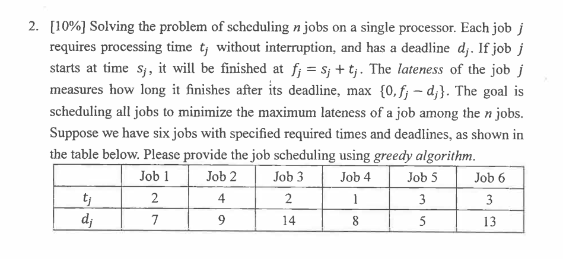

# winning strategy-subtraction game

 
 
 
 
 
 
 
 
 

# difference constraints

# 113 成大

什麼是 Prüfer sequence？
Prüfer sequence 是一種將具有 $n$ 個節點的 標號樹 （Labeled trees）映射到長度為 $n-2$ 的序列的方法。這種映射是一一對應的（雙射），因此它常被用來證明 凱萊公式（Cayley's formula），即 $n$ 個節點的標號樹總共有 $n^{n-2}$ 棵。

核心特性
序列長度：對於一個有 $n$ 個節點的樹，其 Prüfer sequence 的長度恰好為 $n-2$。
度數關係：一個編號為 $i$ 的節點，若其在樹中的 度數（degree） 為 $d_i$，則該編號 $i$ 在 Prüfer sequence 中會恰好出現 $d_i - 1$ 次。

葉節點（Leaf）：度數為 1 的節點，永遠不會出現在序列中 5。
題目給定節點數 $n=10$，且各節點的度數序列為 $(1, 3, 1, 3, 2, 1, 1, 3, 1, 3)$。
確認序列長度：
因為 $n=10$，對應的 Prüfer sequence 長度應為 $10 - 2 = 8$。
計算各編號出現次數：
根據 $d_i - 1$ 原則，各編號在序列中出現的次數如下：
編號 2, 4, 8, 10：度數皆為 3，各出現 $3-1 = \mathbf{2}$ 次。
編號 5：度數為 2，出現 $2-1 = \mathbf{1}$ 次。
其餘編號 (1, 3, 6, 7, 9)：度數為 1，出現 $1-1 = 0$ 次。
排列組合計算：
問題轉化為：將這 8 個名額分配給上述編號。這是一個 不盡相異物排列 問題：
$$\frac{8!}{2! \cdot 2! \cdot 2! \cdot 2! \cdot 1!} = \frac{40320}{16} = \mathbf{2520}$$
因此，符合該度數序列的生成樹總共有 2520 棵。

 
 
 
 

# 113 台科

利用**Earlist Deadline First**

| Job | Job5 | Job1 | Job4 | Job2 | Job6 | Job3 |
| --- | :---: | :---: | :---: | :---: | :---: | :---: |
| $t_j$ | 3 | 2 | 1 | 4 | 3 | 2 |
| $d_j$ | 5 | 7 | 8 | 9 | 13 | 14 |
| $s_j$ | 0 | 3 | 5 | 6 | 10 | 13 |
| $f_j$ | 3 | 5 | 6 | 10 | 13 | 15 |
| $lateness_j$ | 0 | 0 | 0 | 1 | 0 | 1 |

# RSA

已知資料

- p = 11, q = 29
- 公鑰  (e, n) = (3, 319)
- 明文  M = 100

第 1 步：計算 $n$ 與 $\varphi(n)$  
$n = p \cdot q = 11 \cdot 29 = 319$  
$\varphi(n) = (p-1)(q-1) = 10 \cdot 28 = 280$

第 2 步：計算私鑰 $d$  
私鑰 $d$ 滿足:$d \cdot e \equiv 1 \pmod{\varphi(n)}$  
即  
$3 \cdot d \equiv 1 \pmod{280}$  
檢查 3 的模 280 乘法逆元:  
$3 \cdot 187 = 561 \equiv 1 \pmod{280}$  
所以  
$\boxed{d = 187}$

第 3 步：加密訊息 $M = 100$  
RSA 加密公式:  
$C = M^e \mod n$  
$C = 100^3 \mod 319$  
先計算 $100^2 \mod 319$  
$100^2 = 10,000$  
$10,000 \div 319 \approx 31 \text{ 餘 } 111$  
所以  
$100^2 \equiv 111 \pmod{319}$  
再乘一次 100:  
$100^3 \equiv 111 \cdot 100 \mod 319$  
$111 \cdot 100 = 11100$  
$11100 \div 319 \approx 34 \text{ 餘 } 254$  
所以密文：  
$\boxed{C = 254}$

答案

- 私鑰： $d = 187$
- 密文： $C = 254$
