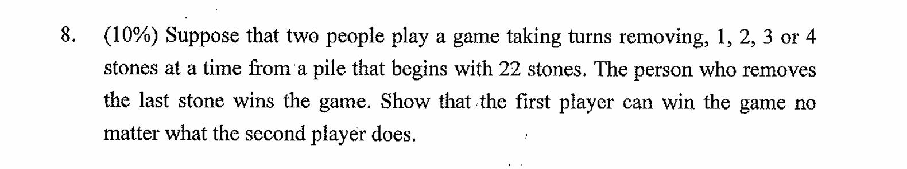
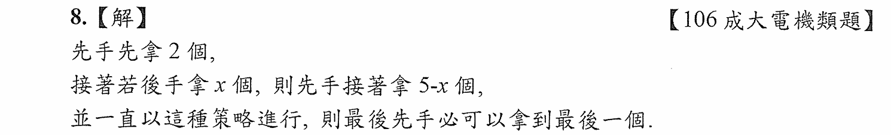
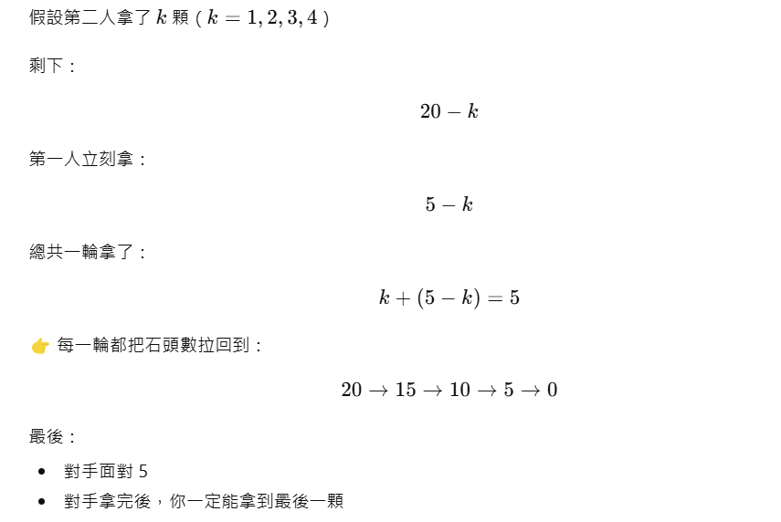
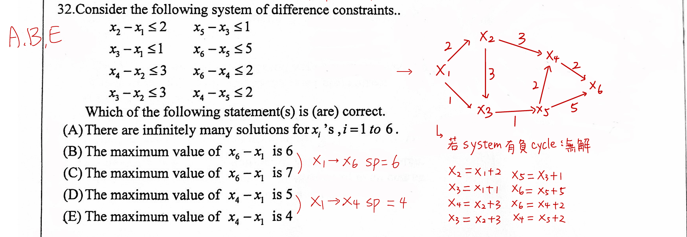
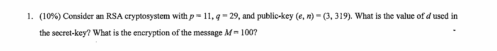

# winning strategy-subtraction game

 
 
 
 
 
 
 
 
 

# difference constraints

# RSA

已知資料

- p = 11, q = 29
- 公鑰  (e, n) = (3, 319)
- 明文  M = 100

第 1 步：計算 $n$ 與 $\varphi(n)$  
$n = p \cdot q = 11 \cdot 29 = 319$  
$\varphi(n) = (p-1)(q-1) = 10 \cdot 28 = 280$

第 2 步：計算私鑰 $d$  
私鑰 $d$ 滿足:$d \cdot e \equiv 1 \pmod{\varphi(n)}$  
即  
$3 \cdot d \equiv 1 \pmod{280}$  
檢查 3 的模 280 乘法逆元:  
$3 \cdot 187 = 561 \equiv 1 \pmod{280}$  
所以  
$\boxed{d = 187}$

第 3 步：加密訊息 $M = 100$  
RSA 加密公式:  
$C = M^e \mod n$  
$C = 100^3 \mod 319$  
先計算 $100^2 \mod 319$  
$100^2 = 10,000$  
$10,000 \div 319 \approx 31 \text{ 餘 } 111$  
所以  
$100^2 \equiv 111 \pmod{319}$  
再乘一次 100:  
$100^3 \equiv 111 \cdot 100 \mod 319$  
$111 \cdot 100 = 11100$  
$11100 \div 319 \approx 34 \text{ 餘 } 254$  
所以密文：  
$\boxed{C = 254}$

答案

- 私鑰： $d = 187$
- 密文： $C = 254$
