# 106 中正

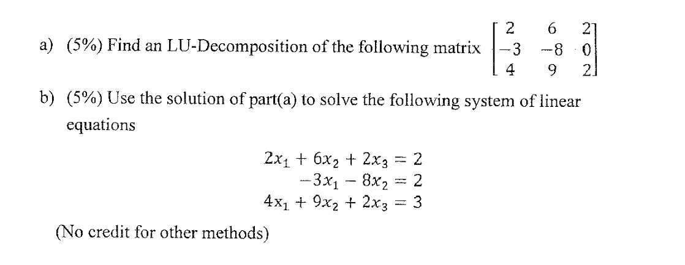
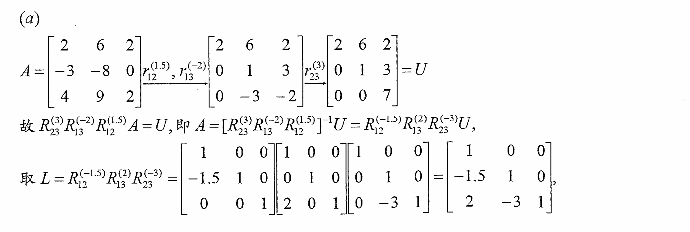
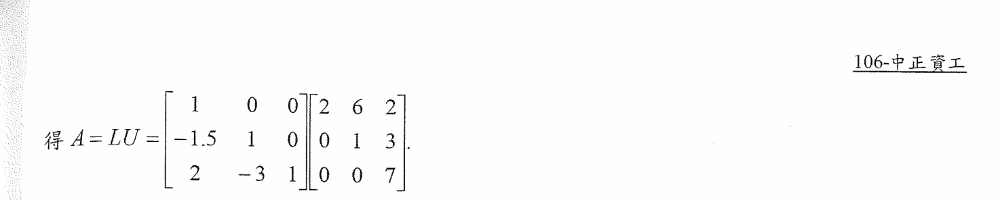
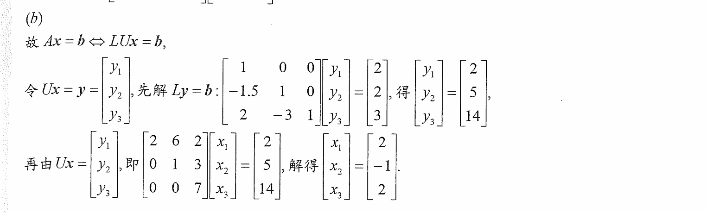

 
 
 
 
 
 
 
 
 
 
 
 
 
 
 
 

# 107 台科

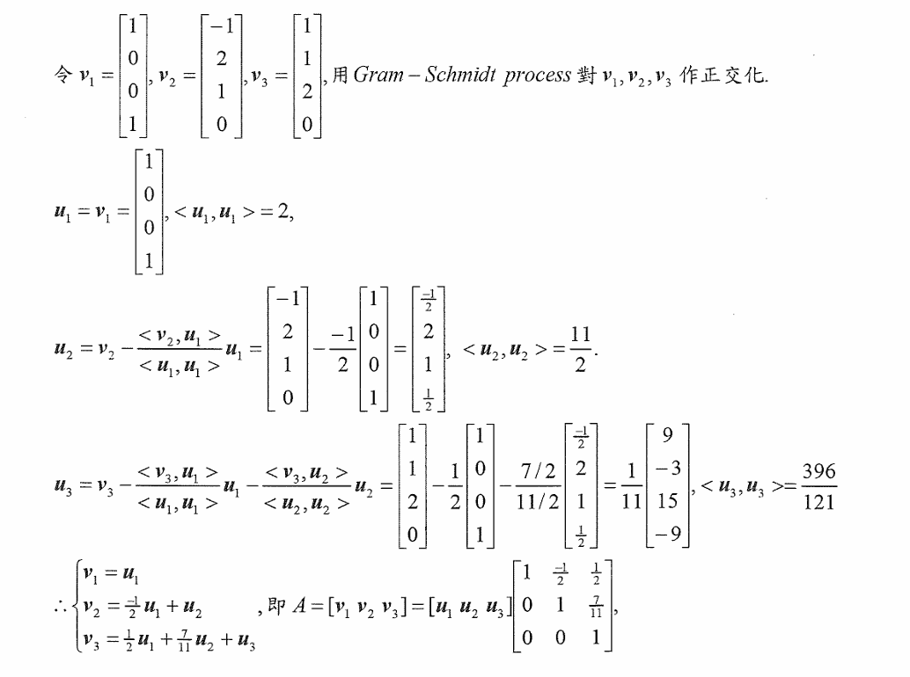
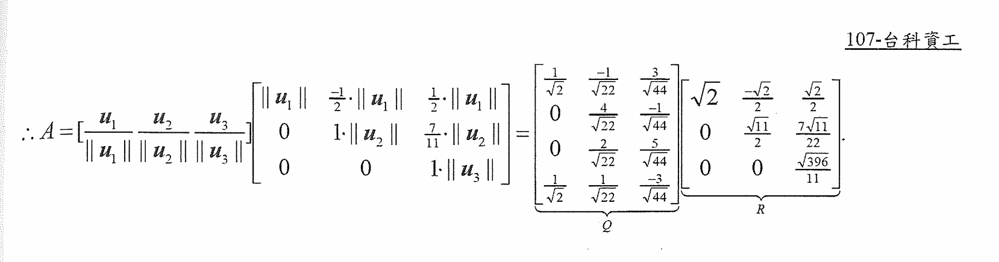

 
 
 
 

# 108 中央

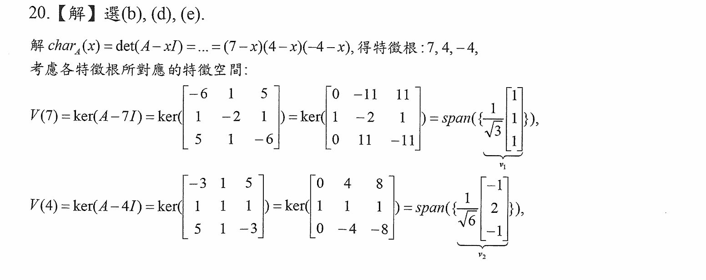
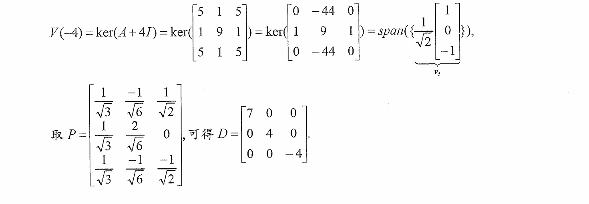

# 107 中正

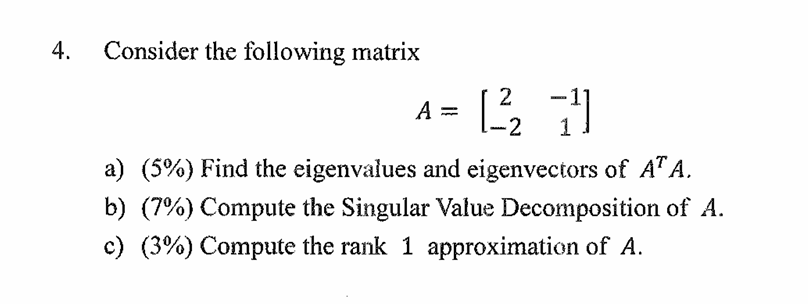
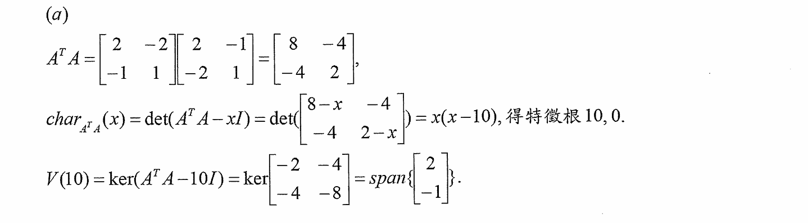
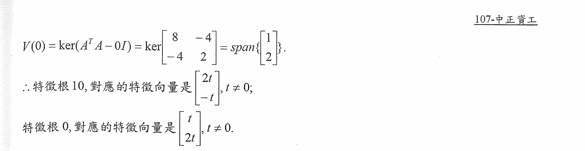
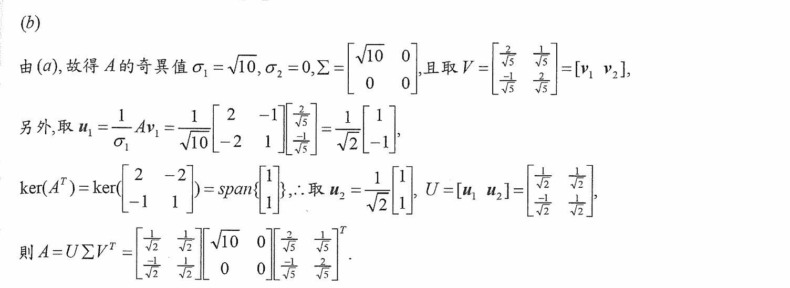

# 105 中央

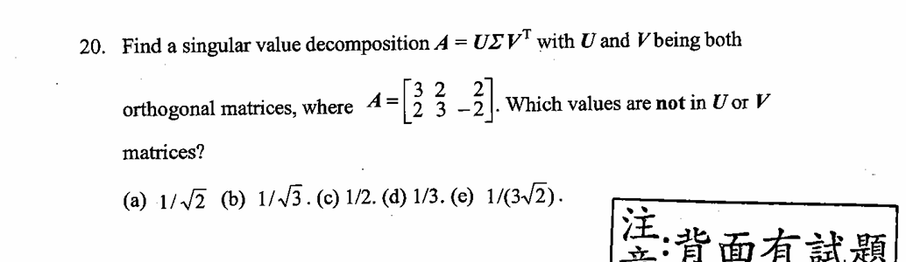
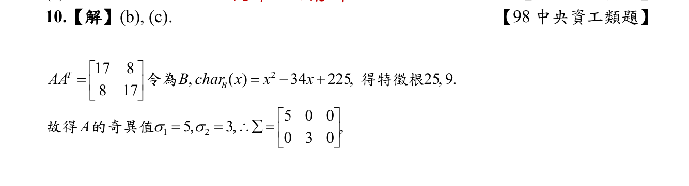
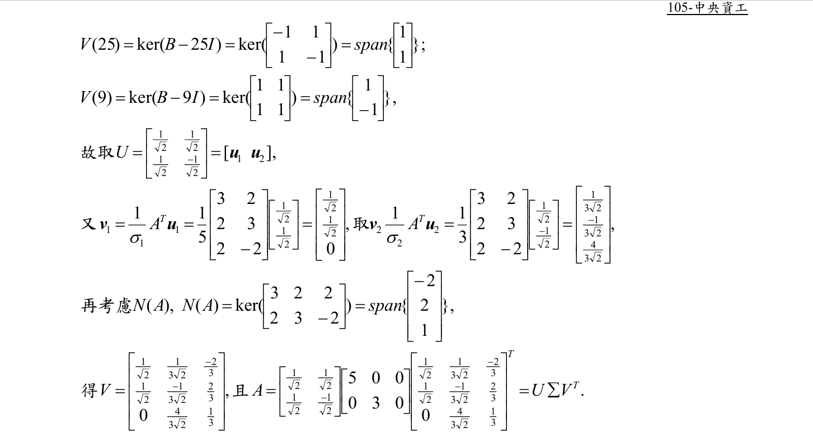

# 105 師大

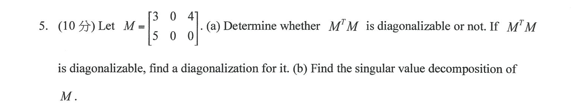
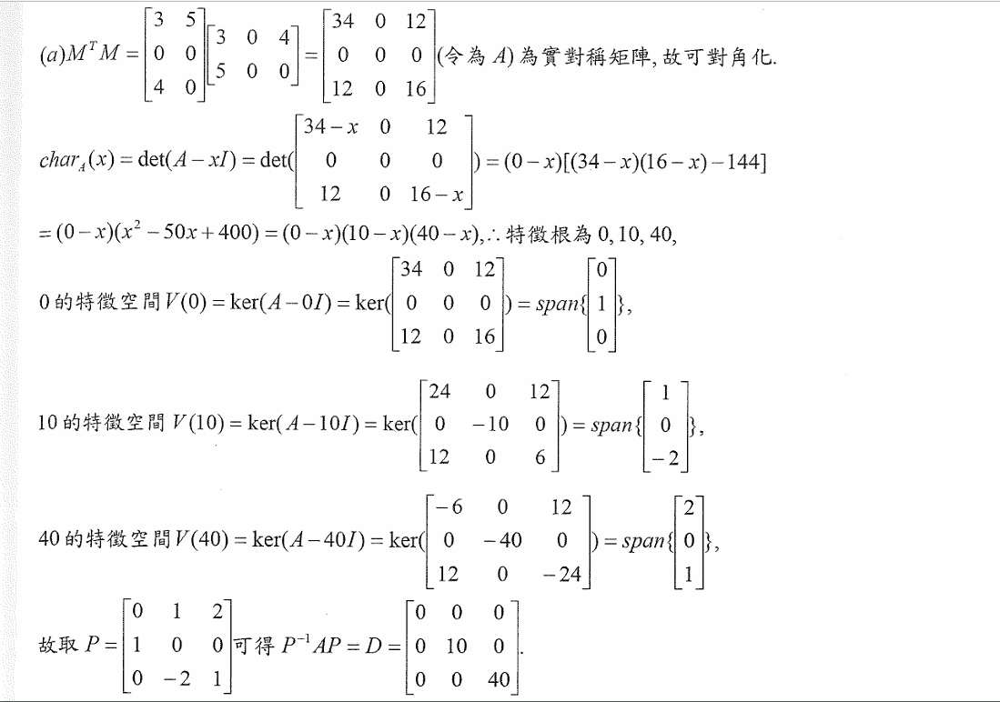
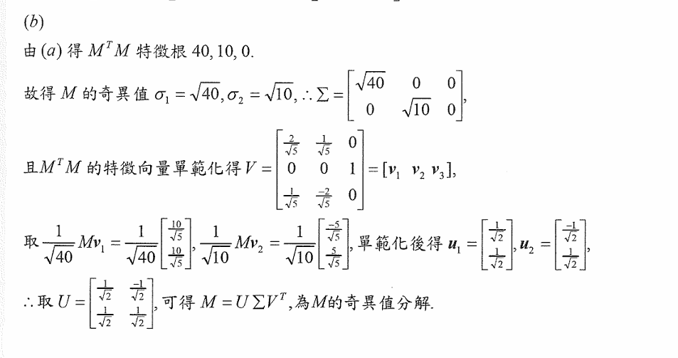

# 106 臺北

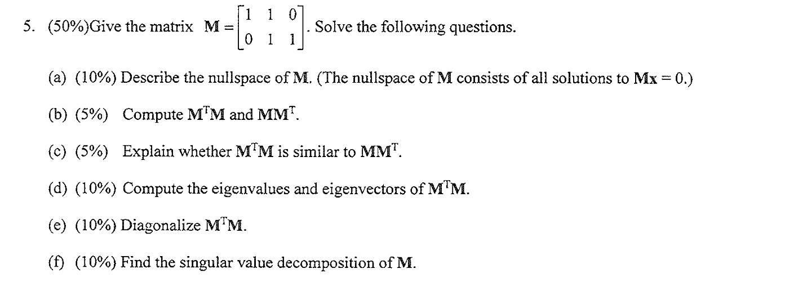

(a) Nullspace of $M$

The nullspace $N(M)$ is the set of all vectors $\mathbf{x}$ such that $M\mathbf{x} = \mathbf{0}$.

$$\begin{bmatrix} 1 & 1 & 0 \\ 0 & 1 & 1 \end{bmatrix} \begin{bmatrix} x_1 \\ x_2 \\ x_3 \end{bmatrix} = \begin{bmatrix} 0 \\ 0 \end{bmatrix}$$

$x_1 + x_2 = 0 \implies x_1 = -x_2$

$x_2 + x_3 = 0 \implies x_3 = -x_2$

Let $x_2 = c$ (free variable). Then $\mathbf{x} = \begin{bmatrix} -c \\ c \\ -c \end{bmatrix} = c \begin{bmatrix} 1 \\ -1 \\ 1 \end{bmatrix}$.

The nullspace is the span of the vector $\begin{bmatrix} 1 & -1 & 1 \end{bmatrix}^T$.

(b) Compute $M^T M$ and $MM^T$

$$M^T = \begin{bmatrix} 1 & 0 \\ 1 & 1 \\ 0 & 1 \end{bmatrix}$$

$M^T M$ ($3 \times 3$):

$$\begin{bmatrix} 1 & 0 \\ 1 & 1 \\ 0 & 1 \end{bmatrix} \begin{bmatrix} 1 & 1 & 0 \\ 0 & 1 & 1 \end{bmatrix} = \begin{bmatrix} 1 & 1 & 0 \\ 1 & 2 & 1 \\ 0 & 1 & 1 \end{bmatrix}$$

$MM^T$ ($2 \times 2$):

$$\begin{bmatrix} 1 & 1 & 0 \\ 0 & 1 & 1 \end{bmatrix} \begin{bmatrix} 1 & 0 \\ 1 & 1 \\ 0 & 1 \end{bmatrix} = \begin{bmatrix} 2 & 1 \\ 1 & 2 \end{bmatrix}$$

(c) Is $M^T M$ similar to $MM^T$?

No. Similar matrices must have the same dimensions. $M^T M$ is a $3 \times 3$ matrix, while $MM^T$ is a $2 \times 2$ matrix. Therefore, they cannot be similar. However, they do share the same non-zero eigenvalues.

(d) Eigenvalues and Eigenvectors of $M^T M$

To find the eigenvalues $\lambda$, we solve $\det(M^T M - \lambda I) = 0$:

$$\begin{vmatrix} 1-\lambda & 1 & 0 \\ 1 & 2-\lambda & 1 \\ 0 & 1 & 1-\lambda \end{vmatrix} = 0$$

Expanding along the first row:$(1-\lambda)[(2-\lambda)(1-\lambda) - 1] - 1(1-\lambda) = 0$$(1-\lambda)[\lambda^2 - 3\lambda + 1] - (1-\lambda) = 0$$(1-\lambda)(\lambda^2 - 3\lambda) = 0 \implies -\lambda(\lambda-1)(\lambda-3) = 0$

Eigenvalues: $\lambda_1 = 3, \lambda_2 = 1, \lambda_3 = 0$.

Eigenvectors:

For $\lambda_1 = 3$: $\mathbf{v}_1 = \begin{bmatrix} 1 & 2 & 1 \end{bmatrix}^T$ (normalized: $\frac{1}{\sqrt{6}}\begin{bmatrix} 1 & 2 & 1 \end{bmatrix}^T$)

For $\lambda_2 = 1$: $\mathbf{v}_2 = \begin{bmatrix} -1 & 0 & 1 \end{bmatrix}^T$ (normalized: $\frac{1}{\sqrt{2}}\begin{bmatrix} -1 & 0 & 1 \end{bmatrix}^T$)

For $\lambda_3 = 0$: $\mathbf{v}_3 = \begin{bmatrix} 1 & -1 & 1 \end{bmatrix}^T$ (normalized: $\frac{1}{\sqrt{3}}\begin{bmatrix} 1 & -1 & 1 \end{bmatrix}^T$)

(e) Diagonalize $M^T M$

Since $M^T M$ is symmetric, it is diagonalized by $M^T M = V \Lambda V^T$, where $V$ is the orthogonal matrix of eigenvectors and $\Lambda$ is the diagonal matrix of eigenvalues.

$$V = \begin{bmatrix} 1/\sqrt{6} & -1/\sqrt{2} & 1/\sqrt{3} \\ 2/\sqrt{6} & 0 & -1/\sqrt{3} \\ 1/\sqrt{6} & 1/\sqrt{2} & 1/\sqrt{3} \end{bmatrix}, \quad \Lambda = \begin{bmatrix} 3 & 0 & 0 \\ 0 & 1 & 0 \\ 0 & 0 & 0 \end{bmatrix}$$

(f) Singular Value Decomposition (SVD) of $M$

The SVD is $A_{2 \times 3} = U_{2 \times 2} \Sigma_{2 \times 3} V^T_{3 \times 3}$.

$U = [\underbrace{\mathbf{u_1} \dots \mathbf{u_r}}_{R(A)} | \underbrace{\mathbf{u_{r+1}} \dots \mathbf{u_m}}_{N(A^T)}] ,V = [\underbrace{\mathbf{v_1} \dots \mathbf{v_r}}_{R(A^T)} | \underbrace{\mathbf{v_{r+1}} \dots \mathbf{v_n}}_{N(A)}]$

$\Sigma$: Square roots of non-zero eigenvalues of $M^T M$.$\sigma_1 = \sqrt{3}, \sigma_2 = \sqrt{1}$. Thus, $\Sigma = \begin{bmatrix} \sqrt{3} & 0 & 0 \\ 0 & 1 & 0 \end{bmatrix}$.

$V$: The eigenvectors of $M^T M$ found in part (d).

$v_3=N(A)=ker\begin{bmatrix} 1 & 1 & 0 \\ 0 & 1 & 1 \end{bmatrix}=\begin{bmatrix} 1 \\ -1 \\ 1 \end{bmatrix}$

$U$: Found via $u_i = \frac{1}{\sigma_i}Mv_i$.

$u_1 = \frac{1}{\sqrt{3}} \begin{bmatrix} 1 & 1 & 0 \\ 0 & 1 & 1 \end{bmatrix} \begin{bmatrix} 1/\sqrt{6} \\ 2/\sqrt{6} \\ 1/\sqrt{6} \end{bmatrix} = \begin{bmatrix} 1/\sqrt{2} \\ 1/\sqrt{2} \end{bmatrix}$

$u_2 = \frac{1}{1} \begin{bmatrix} 1 & 1 & 0 \\ 0 & 1 & 1 \end{bmatrix} \begin{bmatrix} 1/\sqrt{2} \\ 0 \\ -1/\sqrt{2} \end{bmatrix} = \begin{bmatrix} 1/\sqrt{2} \\ -1/\sqrt{2} \end{bmatrix}$

Result: $M = \begin{bmatrix} 1/\sqrt{2} & -1/\sqrt{2} \\ 1/\sqrt{2} & 1/\sqrt{2} \end{bmatrix} \begin{bmatrix} \sqrt{3} & 0 & 0 \\ 0 & 1 & 0 \end{bmatrix} \begin{bmatrix} 1/\sqrt{6} & -1/\sqrt{2} & 1/\sqrt{3} \\ 2/\sqrt{6} & 0 & -1/\sqrt{3} \\ 1/\sqrt{6} & 1/\sqrt{2} & 1/\sqrt{3} \end{bmatrix}^T$

 
 
 
 
 

# 108 交大

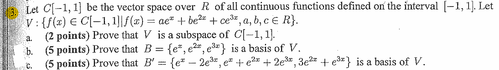
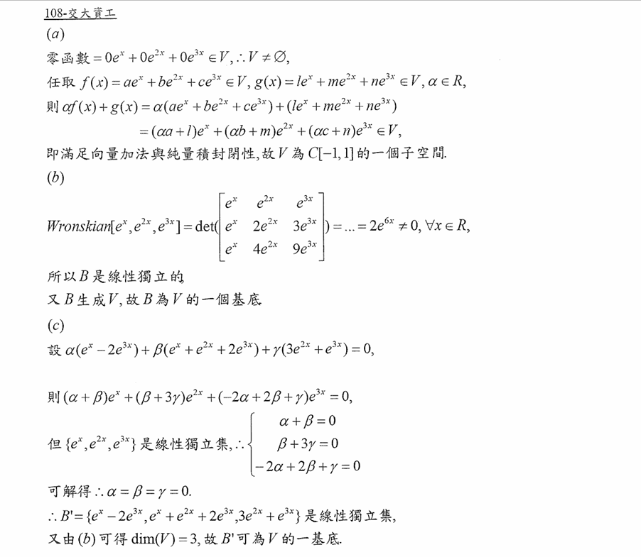

# 106 師大

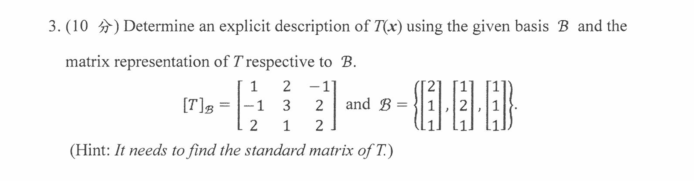
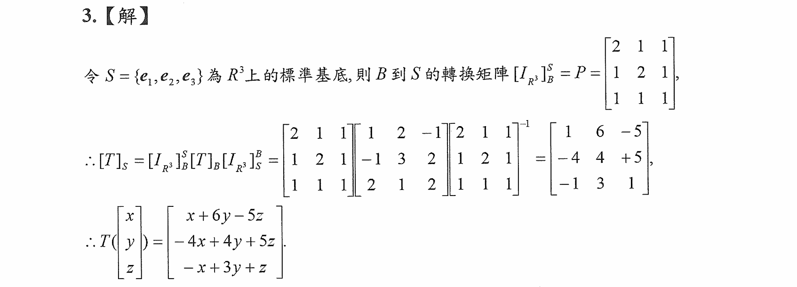

# 110 台科

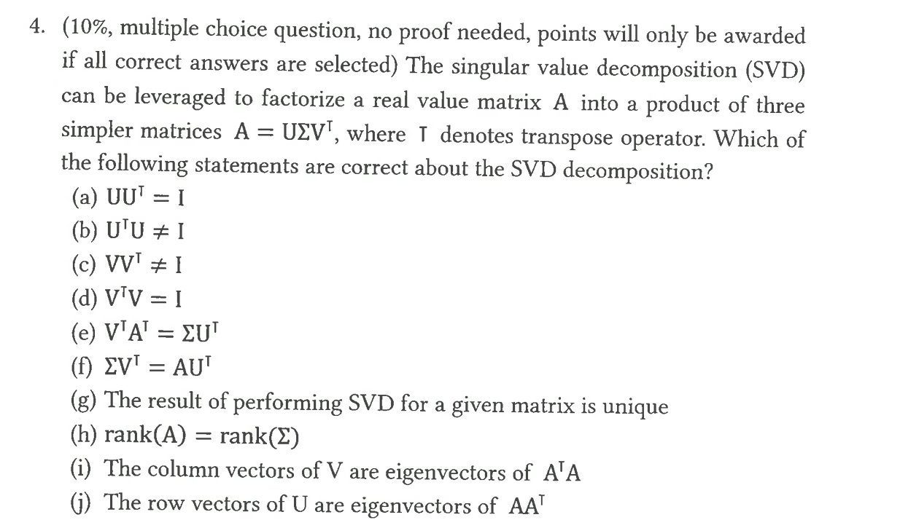

\<sol\>  A,D,H,I

 
 
 
 
 
 
 
 

# 108 中正

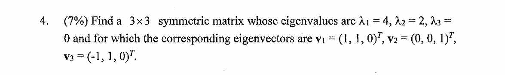
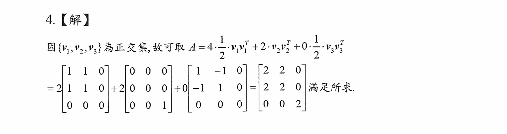

 
 
 
 
 
 
 
 

# Spectral Decomposition/Eigen-decomposition

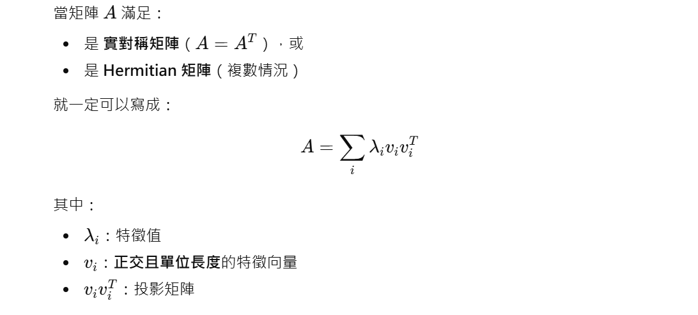

---
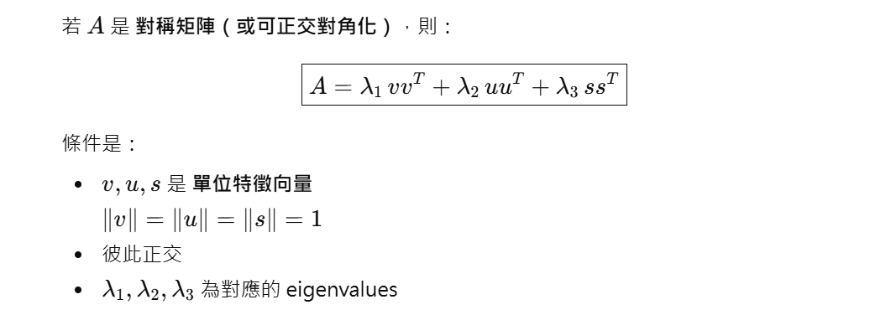

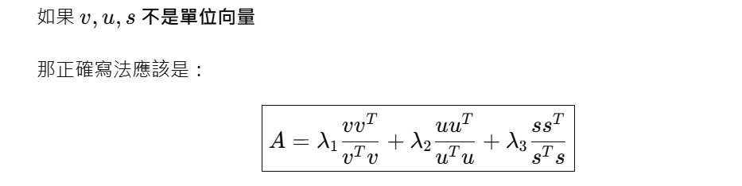

# 110 師大

1. 核心概念

給定平面的單位法向量 $\mathbf{u}$，反射算子 $T_W$ 可以表示為：

$$T_W(\mathbf{x}) = (I - 2\mathbf{uu}^T)\mathbf{x}$$

其中：

$I$ 是單位矩陣。

$\mathbf{u}$ 是平面的 單位法向量（必須將長度正規化為 1）。

$\mathbf{uu}^T$ 是投影矩陣，將向量投影到法向量的方向上。

2. 具體推導步驟

第一步：找出法向量並正規化

平面的法向量為 $\mathbf{n} = \begin{bmatrix} 1 \\ -2 \\ 3 \end{bmatrix}$。其長度為 $\|\mathbf{n}\| = \sqrt{1^2 + (-2)^2 + 3^2} = \sqrt{14}$。

因此，單位法向量 $\mathbf{u}$ 為：

$$\mathbf{u} = \frac{1}{\sqrt{14}} \begin{bmatrix} 1 \\ -2 \\ 3 \end{bmatrix}$$

第二步：計算 $\mathbf{uu}^T$

$$\mathbf{uu}^T = \frac{1}{14} \begin{bmatrix} 1 \\ -2 \\ 3 \end{bmatrix} \begin{bmatrix} 1 & -2 & 3 \end{bmatrix} = \frac{1}{14} \begin{bmatrix} 1 & -2 & 3 \\ -2 & 4 & -6 \\ 3 & -6 & 9 \end{bmatrix}$$

第三步：計算反射矩陣 $H = I - 2\mathbf{uu}^T$

$$H = \begin{bmatrix} 1 & 0 & 0 \\ 0 & 1 & 0 \\ 0 & 0 & 1 \end{bmatrix} - \frac{2}{14} \begin{bmatrix} 1 & -2 & 3 \\ -2 & 4 & -6 \\ 3 & -6 & 9 \end{bmatrix}$$

$$H = \begin{bmatrix} 1 & 0 & 0 \\ 0 & 1 & 0 \\ 0 & 0 & 1 \end{bmatrix} - \frac{1}{7} \begin{bmatrix} 1 & -2 & 3 \\ -2 & 4 & -6 \\ 3 & -6 & 9 \end{bmatrix}$$

$$H = \frac{1}{7} \left( \begin{bmatrix} 7 & 0 & 0 \\ 0 & 7 & 0 \\ 0 & 0 & 7 \end{bmatrix} - \begin{bmatrix} 1 & -2 & 3 \\ -2 & 4 & -6 \\ 3 & -6 & 9 \end{bmatrix} \right) = \frac{1}{7} \begin{bmatrix} 6 & 2 & -3 \\ 2 & 3 & 6 \\ -3 & 6 & -2 \end{bmatrix}$$

3. 最後答案 (Explicit Formula)

將矩陣與向量 $\begin{bmatrix} x & y & z \end{bmatrix}^T$ 相乘，得到：

$$T_W\begin{bmatrix} x \\ y \\ z \end{bmatrix} = \begin{bmatrix} \frac{6x + 2y - 3z}{7} \\ \frac{2x + 3y + 6z}{7} \\ \frac{-3x + 6y - 2z}{7} \end{bmatrix}$$

# 110 師大-2

已知：

$v_1 = \frac{1}{3} \begin{bmatrix} 1 \\ 2 \\ 2 \end{bmatrix}, v_2 = \frac{1}{3} \begin{bmatrix} 2 \\ 1 \\ -2 \end{bmatrix}$

$w_1 = \frac{1}{7} \begin{bmatrix} 2 \\ 3 \\ 6 \end{bmatrix}, w_2 = \frac{1}{7} \begin{bmatrix} 6 \\ 2 \\ -3 \end{bmatrix}$

第一步：驗證長度與正交性

一個算子要是正交的，前提是映射前後的向量性質必須一致：

長度 (Norms):

$\|v_1\| = \frac{1}{3}\sqrt{1^2+2^2+2^2} = 1$, $\|w_1\| = \frac{1}{7}\sqrt{2^2+3^2+6^2} = 1$ (符合)

$\|v_2\| = \frac{1}{3}\sqrt{2^2+1^2+(-2)^2} = 1$, $\|w_2\| = \frac{1}{7}\sqrt{6^2+2^2+(-3)^2} = 1$ (符合)

夾角 (Dot Product):

$v_1 \cdot v_2 = \frac{1}{9}(1\cdot2 + 2\cdot1 + 2\cdot(-2)) = 0$

$w_1 \cdot w_2 = \frac{1}{49}(2\cdot6 + 3\cdot2 + 6\cdot(-3)) = 0$

兩組向量皆為單位正交向量組 (Orthonormal sets)，這表示該正交算子 $T$ 確實存在。

第二步：找出第三個基底向量

為了建立完整的正交矩陣 $Q$，我們需要利用外積 (Cross Product) 找出與前兩者垂直的第三個單位向量。

計算 $v_3 = v_1 \times v_2$:

$$v_3 = \frac{1}{9} \begin{vmatrix} i & j & k \\ 1 & 2 & 2 \\ 2 & 1 & -2 \end{vmatrix} = \frac{1}{9} \begin{bmatrix} -6 \\ 6 \\ -3 \end{bmatrix} = \frac{1}{3} \begin{bmatrix} -2 \\ 2 \\ -1 \end{bmatrix}$$

計算 $w_3 = w_1 \times w_2$:

$$w_3 = \frac{1}{49} \begin{vmatrix} i & j & k \\ 2 & 3 & 6 \\ 6 & 2 & -3 \end{vmatrix} = \frac{1}{49} \begin{bmatrix} -21 \\ 42 \\ -14 \end{bmatrix} = \frac{1}{7} \begin{bmatrix} -3 \\ 6 \\ -2 \end{bmatrix}$$

第三步：求正交矩陣 $T$

我們知道正交矩陣 $T$ 滿足 $T V = W$，其中 $V = [v_1, v_2, v_3]$ 且 $W = [w_1, w_2, w_3]$。

由於 $V$ 與 $W$ 都是正交矩陣，其反矩陣等於轉置矩陣（即 $V^{-1} = V^T$）。

$$T = W V^T = \begin{bmatrix} w_1 & w_2 & w_3 \end{bmatrix} \begin{bmatrix} v_1^T \\ v_2^T \\ v_3^T \end{bmatrix}$$

矩陣相乘計算：

$$T = \frac{1}{7} \begin{bmatrix} 2 & 6 & -3 \\ 3 & 2 & 6 \\ 6 & -3 & -2 \end{bmatrix} \cdot \frac{1}{3} \begin{bmatrix} 1 & 2 & 2 \\ 2 & 1 & -2 \\ -2 & 2 & -1 \end{bmatrix}$$

$$T = \frac{1}{21} \begin{bmatrix} (2+12+6) & (4+6-6) & (4-12+3) \\ (3+4-12) & (6+2+12) & (6-4-6) \\ (6-6+4) & (12-3-4) & (12+6+2) \end{bmatrix}$$

最終答案：

$$T = \frac{1}{21} \begin{bmatrix} 20 & 4 & -5 \\ -5 & 20 & -4 \\ 4 & 5 & 20 \end{bmatrix}$$

這個矩陣 $T$ 即為所求的正交算子，它將 $v_1, v_2$ 映射至 $w_1, w_2$。
