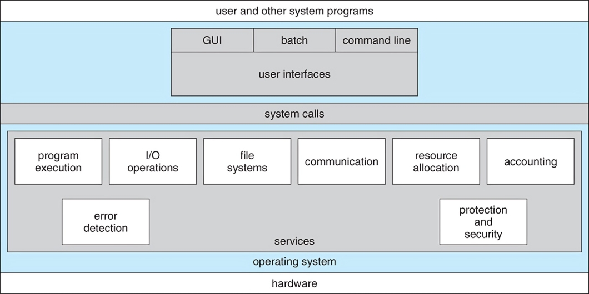
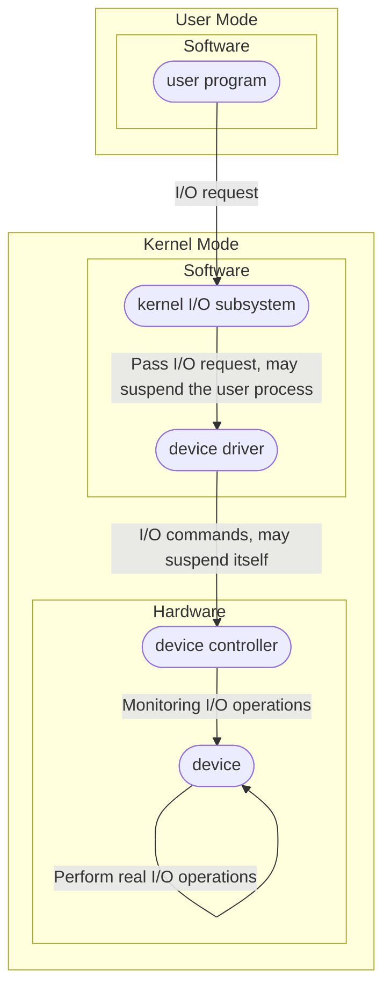

# CH1 OS system types

- OS
  - 沒有一個很明確通用的正式定義
  - 最接近的說法: "Everything a vendor ships when you order an operating system"
  - Kernel definition: "The one program running at all times on the computer" is the kernel, part of the operating system
  - everything else is either a **system program** or an **application program**
    - system program: ships with the operation system, but not part of the kernel
    - application program: all programs not associated with the operation system

- os
  - os user interface
    - user interface to 人
      - Command line
        - <font color="blue">MS-DOS,UNIX,Linux</font>
      - GUI
        - <font color="blue">Mac OS,windows</font>
      - Touch screen
        - <font color="blue">ios,Android</font>
    - system call to applications
  - kernel

A view of os structure



- what os roles
  - 使用者關心的是方便使用電腦以及好的使用效能
    - users want convenience, ease of use and good performance
  - os是一個資源分配的管理者,希望他能有效運用硬體資源
    - os is a resource aloocator making efficient use of HW
  - os也負責指揮控制監督程式的執行,確保安全,防止意外或者故意的操作所造成的系統重大危害
    - control program for managing execution of user programs for protection and security purpose
  - 提供一個讓user program容易執行的環境
    - provides many system calls to be used by the user process. such as I/O operation, process control and IPC,etc
  
- system types
  - Multiprogramming
  - Time-sharing(Multitasking)
    - virtual memory
    - spooling technique
  - Multiprocessor(Tightly-Coupled system)
    - Benifits
      - Increased throughput
      - Economy of scale
      - Increased reliability
    - ASMP(Asymmetric Multiprocessing)
      - Master-Slave architecture
    - SMP(Symmetric Multiprocessing)
  - Distributed system(Loosely-Coupled system)
    - Client-server model
    - peer-to-peer model
  - Real-time system
    - Hard real-time system
    - Soft real-time system
  - Mobile computing
  - Batch system

<br>
<br>
<br>
<br>
<br>
<br>
<br>
<br>
<br>
<br>
<br>
<br>
<br>

# CH2 I/O operations, Hardware resource protection



- I/O operatons
  - Polling I/O
    - **byte**-transfer
  - Interrupted I/O
    - sense interrupt-request line **before** Instruction Fetch
    - device controller raises an interrupt by asserting a signal on the interrupt-request line
  - DMA(Direct Memory Access)
    - **block**-transfer
  - Nonblocking and Asynchronous I/O
    - Blocking=Synchronous
      - process suspended until I/O complete
    - Synchronous
    - Nonblocking
      - I/O call returns as much as available
      - returns quickly with count of bytes read or written
    - Asynchronous
      - process runs while I/O executes
      - I/O subsystem signals process when I/O complete

- Hardware Resource Protection
  - infrastructure
    - Dual mode operation
      - user mode
      - kernel mode
    - Privileged Instruction
      - executed only in kernel mode
        - e.g. the instr. to switch to kernle mode, I/O instr., disable interrupts, clear memory, modify the base/limit registers, modify the value of timer for cpu
  - Hardware Resource Protection
    - I/O protection
      - purpose: 防止user process誤用I/O devices, 降低使用I/O devices複雜度
      - mechanism: all I/O instr. are set as "privileged instr.", so they can be executed only in kernel mode
    - Memory protection
      - purpose: 防止user process非法存取其他process or kernel memory area
      - mechanism: modify the base/limit registers must be privileged instruciton
    - CPU protection
      - purpose: we must ensure that the os maintains control over the CPU. We can't allow a user program to get stuck in an infinite loop or to fail to call system services and never return control to the os
      - mechanism: modify the value of timer for cpu must be privileged instruciton

<br>
<br>
<br>
<br>
<br>
<br>
<br>
<br>
<br>
<br>

# CH3 System call, OS structures, Virtualization

- system call
  - parameters passing of system call
    - registers
    - memory
    - stack
- mechanism
  - how
  - use time to be cpu protection
- policy
  - what
  - determin MAX cpu time quantumn

- Monolithic kernel
  - Linux
  - UNIX
  - Solaris
  - Windows
- Microkernel
  - Mach
- Modules(loadable kernel modules(LKMs))
  - Linux
  - Solaris(先鋒)
  - UNIX
  - MacOS
  - Windows
- Hybrid system
  - Linux
  - Solaris
  - Windows
  - MacOS
  - iOS
  - Android

- Virtual Machine
  - Host
  - Vitual Machine Manager(VMM)
  - Guest
  - different types
    - type 2 use mode
    - type 1 OS(kernel mode)
    - type 0 HardWare
  - implementation of VMMS
    - Pure VM
    - Paravirtualization
    - Programming-environment virtualization
      - Java Virtual Machine(JVM)
    - Emulators
    - Application containment
      - container
  - Cloud Computing
    - Software as a Service(SaaS)
      - office365, salesforce, gmail, google drive, dropbox,...
    - Platform as a Service(PaaS)
      - 金流API, 物流API, 地圖API,...
    - Infrastructure as a Service(IaaS)
      - AWS, Azure,...

<br>
<br>
<br>
<br>
<br>
<br>
<br>
<br>
<br>
<br>
<br>
<br>
<br>
<br>
<br>
<br>
<br>
<br>
<br>
<br>
<br>
<br>
<br>
<br>

# CH4 Process Management, Thread Management

## <font color="blue">Process</font>

## process state diagram

- New
- Ready
- Running
- Waiting
- Terminal

## PCB

1.Pocess state  
2.Program counter  
3.CPU registers  
4.CPU-scheduling information  
5.Memory-management information  
6.Accounting information  
7.I/O status information  
(8.Process ID)

## scheduler 之種類

- Long-Term scheduler
  - Batch system採用
  - Real-time system, Time-sharing system不採用
- Medium-Term scheduler
- Short-Term scheduler

## scheduling criteria

- CPU utilization
- Throughput
- Turnaround time
- Waiting time
- Response time

## CPU Scheduling Algorithm

- **FCFS**
- SJF
  - Non-preemptive SJF->**SJF**
  - Preemptive SJF->**SRJF**
- **RR**
- **priority**
  - aging
- **multilevel queues**
- **multilevel feedback queues**

## Multiple-Processor scheduling

- ASMP(沒什麼好設計的)
- SMP
  - load balancing
    - push migration
    - pull migration
  - processor affinity
    - soft affinity
    - hard affinity

## Real-Time system scheduling

若有Priority Inversion,用Priority Inheritance解決

- Hard real-time(preemptive kernel)
  - Rate-Monotonic scheduling
  - EDF scheduling
- Soft real-time(preemptive kernel)
  - 不提供aging

## <font color="blue">Threads</font>

- private
  - program counter
  - CPU registers set
  - stack
  - local variables
  - thread ID
- shared
  - code section
  - data section(global data)
  - heap
  - static local variables
  - other OS resources(open files, signals, I/O resources,etc.)

- Benefits
  - **responsiveness**
  - **resource sharing**
  - **economy**
  - **scalability**(utilization of multiprocessors architecture)

- Thread management
  - user thread
    - provide a library entirely in user space with no kernel support
    - implement a kernel-level library supported directly by the OS
  - kernel thread

- multithreading models
  - Many-to-One model
  - One-to-One model
  - Many-to-Many model
  
- 2 strategies of creating multiple threads
  - Asynchronous threading(父,兒之thread concurrently execute)
  - Synchronous threading(父thread要等兒thread做完)

- Pthreads library
  - Pthreads is a specification
  - Run on UNIX
  - Can't run on windows os

<br>
<br>
<br>
<br>
<br>
<br>
<br>
<br>
<br>
<br>
<br>
<br>
<br>
<br>
<br>
<br>
<br>
<br>
<br>
<br>
<br>
<br>
<br>
<br>
<br>

# CH5 Deadlock Management

- necessary conditions
  - **mutual exclution**
  - **hold and wait**
  - **no preemption**
  - **circular wait**
- resource-allocation graph
  - no cycle, no deadlock
  - 有cycle不一定有deadlock
    - if every resource only has exactly one instance, 有cycle就有deadlock
- methods for handling deadlocks
  - **deadlock prevent**
    - 破除mutual exclution條件(辦不到)
    - 破除hold and wait條件
    - 破除no preemption條件
    - 破除circular wait條件: resource ordering
  - **deadlock avoidance**
    - banker's algorithm($O(n^2 m)$,n: process,m: resource)
    - if system consisting of **m** resources of the same type with **n** processes running in the system
      - $1 \le MAX_i \le m$
      - $\sum_{i=1}^{n} MAX_i < n + m$

  - **deadlock detection and recovery**
    - detect it, and recover(允許系統進入deadlock)
    - detection algorithm($O(n^2 m)$,n: process,m: resource)
  - **ignore deadlock**
- Recovery from deadlock
  - process and thread termination
    - abort all deadlocked processes
    - abort one process at a time until the deadlock cycle is eliminated(盲目地砍一個)
  - resource preemption

<br>
<br>
<br>
<br>
<br>

# CH6 Process Synchronization, IPC(InterProcess Communication)

- synchronization: process因某些事情之發生 or 不發生,而被迫停頓,要等其他process do something 之後,才可往下進行.
  - Producer-Consumer problem
  - Readers/Writers prblem
    - First variation
    - Second variation
  - The Sleeping barber problem
  - The dinning philosophers problem

- 執行中程式可有兩種型態:
  - independent processes
    - 我的結果不會影響你,你的結果不會影響我
  - cooperation processes
    - 有某種程度的資訊交換
    - 允許process cooperation之理由
      - information sharing
      - computation speedup
      - modularity

- 2 fundamental models of IPC
  - **Shared Memory**
  - **Message Passing**

## **Shared Memory**

- Race Condition problem
  - several processes access and manipulate the same data concurrently and the outcome of the execution depends on the particular order in which the access takes place.
  - resolve race condition problem 2 strategy
    - **disable interrupt**
    - **critical section design**
      - 每個process內,access shared data之程式碼片段稱為critical section
      - c.s.須滿足3性質
        - mutual exclusion
        - progress
        - bounded waiting
      - critical section是要設計Entry section以及Exit section

      ```c
      while(true){
               Entry section;
               C.S.
               Exit sectin;
               R.S.   
           }
      ```

      - 程式語言level
        - monitor
      - OS SW tools(sys. call)level
        - mutex lock,semaphore
      - 基礎
        - C.S. design
          - SW solution
            - peterson solution
          - HW support
            - memory barriers
            - test&set(&lock)
            - compare&set(&lock,0,1)
        - 非C.S. design
          - disable interrupt

- **peterson solution**

    ```c
    Pi                              Pj
    while(true){                    while(true){
      flag[i]=true;/*表明有意*/      flag[j]=true;/*表明有意*/
      turn=j;/*禮讓對方*/            turn=i;/*禮讓對方*/ 
      while(flag[j] && turn==j);    while(flag[i] && turn==i);
      /*當對方有意且權杖在對方身上,則我等 */    /*當對方有意且權杖在對方身上,則我等 */
      C.S.                           C.S.
      flag[i]=false;/*手放下*/       flag[j]=false;/*手放下*/
      R.S.                           R.S.
    }                               }
    ```

- **memory barriers**

    ```c
    Pi
    while(true){
      turn=j;/*禮讓對方*/
      memory_barrier();
      flag[i]=true;/*表明有意*/
      C.S.
      flag[i]=false;/*手放下*/
      R.S.
    }
    ```

- **test&set(&lock),compare&set(&lock,0,1)**

  - <font color="blue">是CPU特殊指令</font>

    ```c
    boolean test_and_set(boolean *target){
      boolean ret=*target;
      *target=false;
      return ret;
    }
    ```

    ```c
    int CAS(int *value, int expected, int new_value){
      int temp=*value;
      if(*value==expected)
        *value=new_value;
      return temp;
    }
    ```

  - test&set,CAS用於critical section problem
  
    ```c
    while(true){
      wairing[i]=true;
      key=true;
      while(waiting[i] && key)
        key=test_and_set(&lock); or key=CAS(&lock,0,1);//決一死戰,誰先搶到,誰先win
      waiting[i]=false;//Pi不用等了,可進入C.S.
      C.S.
      j=(i+1)%n;
      while(j!=i && !waiging[j])//找出下一個想進入C.S.之processj
        j=(j+1)%n;
      if(j==i)//此時無人想進入C.S.
        lock=false;//鑰匙掛高空,等人去搶
      else//Pj像進入C.S.
        waiting[j]=false;//Pj不用等了,可進入C.S.,此時lock為true
      R.S.
    }
    ```

- **mutex lock**

    ```c
      while(true){
        acquire lock;
        C.S.
        release lock;
        R.S.
      }
     ```

  - a mutex lock透過boolean variable: available,用以指示the lock is available or not.
  - 提供兩個atomic operations:
    - acquire()

      ```c
      acquire(){
        while(!available);//if lock被取走就卡
        available=false;//lock被Pi取走
      }
      ```

    - release()

      ```c
      release(){
        available=true;
      }
      ```

  - 利用cpu硬體指令完成mutex lock

    ```c
    typedef struct{
      int available;//0->lock is available,1->lock is unavailable
    }lock;

    lock mutex;
    //使用CAS製作acquire
    void acquire(lock *mutex){
      while(CAS(&mutex->available,0,1)!=0);
      return;
    }
    //使用test_and_set製作acquire
    void acquire(lock *mutex){
      while(test_and_set(&mutex->available)!=0);
      return;
    }
    void release(lock *mutex){
      mutex->available=0;
      return;
    }
    ```

- **semaphore**
  - semaphore is a data type based on int
  - semaphore只能透過兩個atomic operation來存取
    - wait() or P()

      ```c
      wait(s){
        while(s<=0);
        s--;
      }
      ```

    - signal() or V()

      ```cpp
      signal(s){
        s++;
      }
      ```

  - 用於C.S. design
  
      ```c
      semaphore mutex=1;
      Pi
      wait(mutex);
      C.S.
      signale(mutex);
      R.S.
      ```

- **monitor**
  - a monitor type is  a ADT(Abstract Data Type),想像成class,包含三部分
    - 共享變數宣告
    - a set of programmer-defined operations
    - 初始區
  - monitor本身已保證了互斥性質
    - the monitor construct ensures that only **one** procss at a time is **active** within the monitor
      - 如此保證了monitor內的shared variables不會發生race condition problem
    - 代表programmer無需煩惱race condition problem,只需專心解決synchronization
  - condition變數
    - 為了讓programmer可以用monitor解決synchronization problem,需提供一種特殊形態變數,即condition type variables
    - 宣告格式:
  
      ```c
      condition x,y;
      ```

    - 此變數只有兩種operation提供呼叫:
      - x.wait()
        - 類似block() sys. call
      - x.signal()
        - 類似wakeup() sys. call
        - default is FIFO Queue

## liveness (是一個好性質,但沒考過)

- system 必須滿足確保processes make progress during their execution life cycle

## **Message Passing IPC**

- **無須**共享相同的位址空間,在分散式系統中特別有用.
- 兩個processes要溝通,步驟如下:
  - 建立communication link
  - messages 相互傳輸
  - 傳輸完畢, release communication link
- OS提供至少兩種system calls
  - send(message)
  - receive(message)
- messages sent by a process can be either **fixed** or **variable** in size.

- message passing
  - direct communication
    - symmetric
      - 收送雙方皆須相互指名對方process ID才能建立通訊鏈結
        - send(Q, message)
        - receive(P, message)
    - asymmetric(跟e-mail很像)
      - 只有sender需指名recipient的process ID
        - send(Q, message)
        - receive(id, message)
  - indirect communication
    - 收送雙方是透過共享的mailbox來溝通, each mailbox有自己獨一無二的ID
      - send(mailbox, message)
      - receive(mailbox, message)
- synchronization
  - message passing 可以是blocking(synchronous) or nonblocking(asynchronous)
    - Blocking send
    - Nonblocking send
    - Blocking receive
    - Nonblocking receive
  - 如果收送雙方皆是採用Blocking_send()及blocking_receive(),則此同步模式叫:rendezvous
- Buffering(message queue's size)
  - zero capacity
    - also called rendezvous
  - bounded capacity
  - unbounded capacity
    - the sender doesn't have to be blocked

# CH7 Main Memory

## Binding Time

- compile time
- loading time
- execution time
  
## Memory Management methods in OS

- **Contiguous Memory Allocation**
  - external fragmetation
    - First Fit
    - Best Fit
    - Worst Fit
- **Page**
  - internal fragmentation
  - page table
    - hierarchical paging
    - hashed page table
    - inverted page table
- **Segment**
  - external fragmentation
  - Base and Limit
- Paged Segment

<br>
<br>
<br>
<br>
<br>
<br>
<br>
<br>
<br>
<br>
<br>
<br>
<br>

# CH8 Virtual Memory

- 實現Virtual Memory 技術: Demand Paging
  - pure demand paging
  - prepaging

## Page Replacement Algorithm(沒有最差，只有最佳)

- **FIFO**(belady's anomaly)
- **OPT**(stack property)
- **LRU**(stack property)
- LRU-approximation(stack property)
  - **Additional regerence bits usage**
  - **Second cance**
  - **Enhanced second chance**
- **LFU**(belady's anomaly)
- **MFU**(belady's anomaly)

- **Thrashing**
  - CPU utilization down
  - Paging I/O devices 異常忙碌
  - processes spends more time on paging I/O than normal execution
    - technique to handle Thrashing
      - **decrease multiprogramming degree**(已經thrashing)
      - **page fault frequency control**
      - **working set model**
- Allocation Kernel Memory
  - Buddy system
  - Slab allocation(has no internel,externel fragmentation)

<br>
<br>
<br>
<br>
<br>
<br>
<br>
<br>
<br>
<br>
<br>
<br>

# CH9 Massive Storage System

## Hard Disk

- cylinder
- tracks
- sectors(磁碟控制器控制read,write之基本單位)
- Disk Access Time
  - Seek Time
  - Rotatinal latency
  - Transfer Time

## Free-Space Management

- Bit vector
- Linked List
  - Grouping
  - Counting

## File Allocation Methods

- Contiguous Allocation
- Linked Allocation
  - 變形: FAT
- Indexed Allocation
  - Linked scheme
  - Multilevel index
  - Combined scheme(UNIX i-Node structure)

## HDD scheduling(沒有最好與最差之法則)

- **FCFS**
- **SSTF**
- **SCAN**
  - elevator
- **C-SCAN**
- **LOOK**
  - elevator
- **C-LOOK**

## RAID

- improvement of <u>reliability</u> via reduncance <!-- markdownlint-disable-line MD033 -->
  - mirror
  - parity chech
- improvement in <u>performance</u> via parallelism<!-- markdownlint-disable-line MD033 -->
  - data striping
    - bits-level
    - block-level

- RAID0(N部)
  - block-level striping
- RAID1(mirror)(N/2部)
- RAID2(ECC-Error-Correcting Code)
  - 沒有實際產品
- RAID3(ECC-Error-Correcting Code)(N+1部)
  - bit-level striping
  - parity check
- RAID4(ECC-Error-Correcting Code)(N+1部)
  - block-levle striping
  - parity check
- RAID5(ECC-Error-Correcting Code)(N+1部)
- RAID6(ECC-Error-Correcting Code)(N+2部)
- RAID1+RAID0(更好)
- RAID0+RAID1

## File Directory Structure

- Tree-structured Directory
- Acyclic Graph Directory
- General Graph Directory(允許有cycle)

File Access Control

- Owner, Group, Other
- RWX(Read, Write, eXecute)
- command: ```chmod 755 file```

## Consistency Semantic

- UNIX semantic
  - 訂票系統
- Session semantic
  - 網站上的檔案提供下載讓user填寫
- Immutable-Shared-Files semantic
  - 總經理公告文件第3009號

NAS(Network-Attached Strage)

- File-based operation
- 會占用網路頻寬

SAN(Storage-Area Network)

- Block-based operation
- private network
- 不佔用一般網路頻寬
